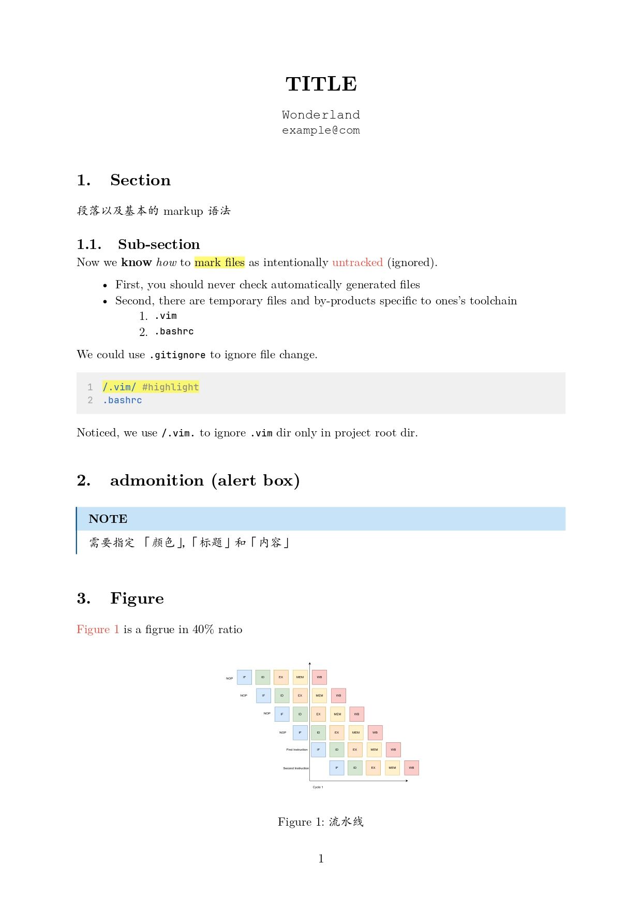
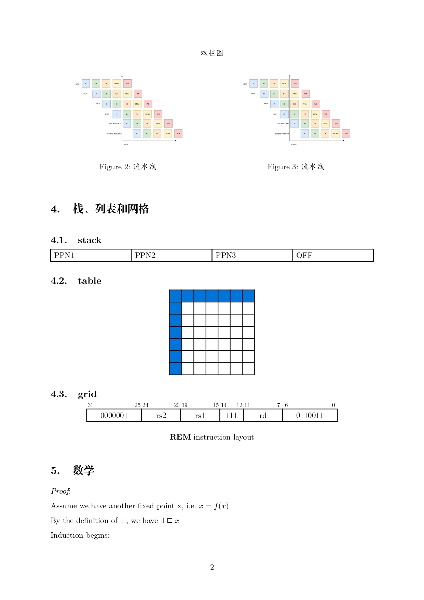
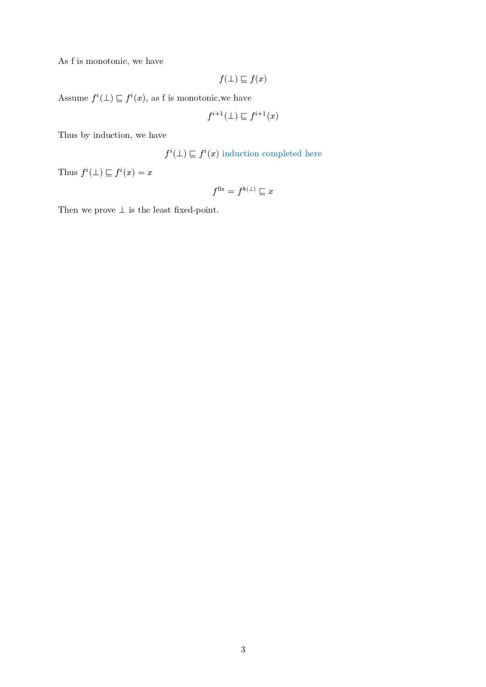

# Typst 模板

`./template.typ` 为模板文件。为使用模板请在新建的文件最上方引用:

```typst
#import "template.typ": *
```

## 字体

正文部分，英文字体设置的是 「New Computer Modern, 可以使用 `typst fonts| grep <>` 来查看字体是否可用。
其余设置请看 `template.typ`

## 显示效果

`main.typ` 的导出效果





## 导出 

- `typst c <file>`
- 使用 vscode 的 typst 插件导出

## 教程推荐

- [官方教程](https://typst.app/docs/tutorial/)
- [所有的数学符号](https://typst.app/docs/reference/symbols/sym/)
- [中文教程](https://typst-doc-cn.github.io/tutorial/)
- [typst-example](https://github.com/sitandr/typst-examples-book)
- [视频教程](https://www.bilibili.com/video/BV1AJ4m1j7Sa)